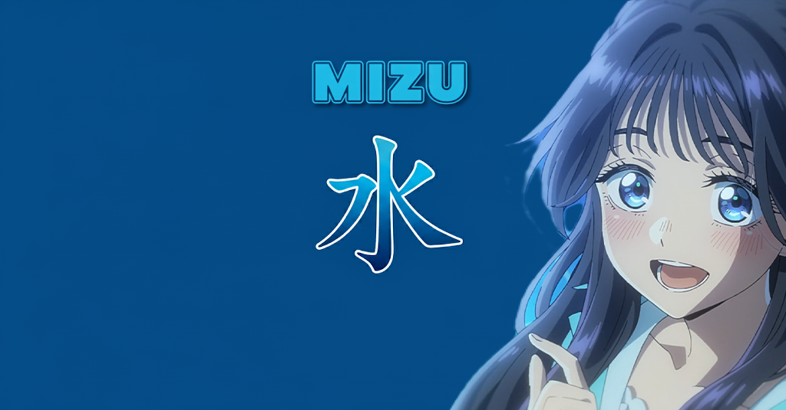
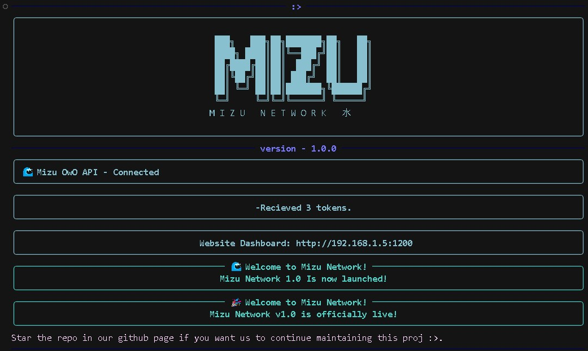
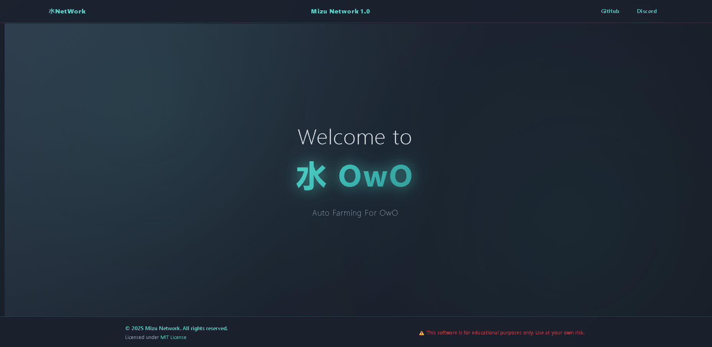

<div align="center">

# <span style="color: #00FFFF;">🌊 Mizu OwO 水</span>

*Advanced Auto Farming Bot for OwO Discord Game*

[](https://mizu)
[](https://choosealicense.com/licenses/mit/)
[](https://www.python.org/downloads/)
[](https://discord.com/)
[]()
[]()
[]()



**The most advanced, feature-rich, and user-friendly OwO farming bot**

</div>

---

## ✨ **Features**

### 🎯 **Core Automation**
- 🤖 **Smart Auto Farming** - Advanced OwO command automation
- 🎮 **Mini Games** - Slots, coinflip, hunt, battle with smart strategies
- 💎 **Economy Management** - Auto sell, shop, daily rewards optimization
- 🏆 **Leveling System** - XP tracking, progression monitoring
- 🎁 **Giveaway Participation** - Auto join Discord giveaways
- 🔐 **Advanced Captcha Solver** - AI-powered captcha recognition

### 🚀 **New Advanced Features**
- ⚡ **AutoEnhance System** - Auto use gems & invest essence
- 🎯 **AutoHuntBot** - Automated huntbot upgrades & management
- 🎲 **RPP Commands** - Auto Run/Piku/Pup every minute
- 💰 **Smart AutoSell** - Intelligent item selling with cash triggers
- 🔄 **Auto Random Commands** - Varied command execution patterns

### 🌐 **Web Dashboard**
- 📊 **Real-time Statistics** - Live performance metrics
- ⚙️ **Advanced Configuration** - Comprehensive settings management
- 📈 **Performance Monitoring** - Resource usage & optimization
- 🎨 **Modern UI** - Beautiful responsive design with dark theme
- 🔧 **Live Controls** - Start/stop/configure without restart

### 🛡️ **Safety & Security**
- 🔒 **Token Protection** - Secure credential management
- 🛡️ **Anti-Detection** - Human-like behavior patterns
- ⏱️ **Smart Delay System** - Randomized timing to avoid detection
- 📡 **API Status Monitoring** - Real-time service health checks
- 🚨 **Safety Checks** - Account protection mechanisms

---

## 🚀 **Quick Start**
   ```bash
   python mizu.py
   ```
   - Bot will start immediately

2. **Access Dashboard:**
   Open: `http://localhost:2000`

### 🐳 **Docker Deployment**
1. **Configure tokens:**
   Create `.env` in the project directory.

2. **Run with Docker Compose:**
   ```bash
   docker-compose up -d
   ```
   
3. **Access Dashboard:**
   Open: `http://localhost:2000`

### 🔄 **Auto-Update System**
```bash
# Update to latest version with settings preservation
python updater.py
```

---

## 📖 **Documentation**

### 📋 **Installation Guides**
- 🪟 [**Windows Setup**](/Tutor/windows.md) - Complete Windows installation guide
- 🐧 [**Linux Installation**](/Tutor/linux.md) - Ubuntu, Debian, CentOS setup
- 🍎 [**macOS Setup**](/Tutor/macos.md) - macOS installation guide  
- 📱 [**Termux (Android)**](/Tutor/termux.md) - Mobile setup guide

### ⚙️ **Configuration**
- 🔑 **Token Setup** - Discord token extraction and setup
- ⚙️ **Settings** - `config/settings.json` configuration options
- 🌐 **Global Settings** - `config/global_settings.json` system settings
- 🎯 **Command Configuration** - Individual command customization

#### 🔒 Security & Tokens
We prioritize security. Instead of plain text files, we recommend using Environment Variables.

1.  Rename `.env.example` to `.env` (or create a new `.env` file).
2.  Add your tokens in the format:
    ```env
    TOKENS="YOUR_TOKEN_1 CHANNEL_ID_1;YOUR_TOKEN_2 CHANNEL_ID_2"
    ```
    *Note: Multiple accounts are separated by semicolons (;)*
3.  **Legacy Support:** `tokens.txt` is still supported but **deprecated**. Please migrate to `.env`.

### 🔧 **Advanced Features**
- 💎 **AutoEnhance** - Automatic gem usage and essence investment
- 🎯 **AutoHuntBot** - Huntbot automation and upgrades
- 💰 **AutoSell** - Smart item selling with triggers
- 🎲 **RPP System** - Random command execution
- 🔄 **Multi-Account** - Managing multiple Discord accounts

### 🛠️ **Development**
- 🤝 [**Contributing Guide**](/CONTRIBUTING.md) - How to contribute
- 📝 **API Documentation** - Internal API reference
- 🧪 **Testing** - Testing procedures and guidelines
- 🔧 **Development Setup** - Local development environment

---

## 🎨 **Screenshots**

<div align="center">

### 🖥️ Desktop CLI


### 🌐 Web Dashboard


</div>

---

## 🔧 **API Integration**

### 🌐 **Mizu Network API**
Our bot integrates with the live Mizu API for enhanced functionality:

- 📡 **Status Monitoring** - Real-time service health checks
- 📢 **Announcements** - Important updates and news
- 🔄 **Version Checking** - Automatic update notifications
- 🛡️ **Safety Updates** - Security patches and warnings
- 📊 **Statistics** - Usage analytics and performance metrics

**API Endpoint:** `https://api.ive.my.id`

### 🎛️ **Web Dashboard API**
The bot includes a built-in REST API for the web dashboard:
- 📊 `/api/stats` - Real-time statistics
- ⚙️ `/api/settings` - Configuration management
- 🎮 `/api/commands` - Command control
- 📈 `/api/performance` - Performance metrics

---

## 🤝 **Contributing**

We welcome all types of contributions! Whether you're a developer, designer, or just want to help improve documentation.

### 🌟 **Ways to Contribute**
- 🐛 **Bug Reports** - Found an issue? Let us know!
- 💡 **Feature Requests** - Have ideas? Share them!
- 💻 **Code Contributions** - Fix bugs or add features
- 📖 **Documentation** - Help improve guides and docs
- 🎨 **Design** - UI/UX improvements
- 🌐 **Translations** - Help make Mizu multilingual

### 📋 **Getting Started**
1. Read our [**Contributing Guidelines**](/CONTRIBUTING.md)
2. Join our [**Discord Community**](https://4NsdaRWD2K)
3. Check [**Good First Issues**](https://github.com/kiy0w0/owomizu/labels/good%20first%20issue)

### 🔧 **Development Setup**
```bash
# Fork and clone the repository
git clone https://github.com/kiy0w0/owomizu.git
cd owomizu

# Set up virtual environment
python -m venv venv
source venv/bin/activate  # Windows: venv\Scripts\activate

# Install dependencies
pip install -r requirements.txt
pip install -r requirements-dev.txt

# Install pre-commit hooks
pre-commit install
```

---

## 📄 **License**

This project is licensed under the MIT License - see the [LICENSE](LICENSE) file for details.

---

## ⚠️ **Disclaimer**

This bot is for educational purposes only. Use at your own risk. The developers are not responsible for any Discord account suspensions or bans that may result from using this bot.

---

## 🌟 **Support & Community**

<div align="center">

### 💬 **Get Help**
[](https://discord.gg/4NsdaRWD2K)
[](https://github.com/kiy0w0/owomizu/issues)

### 🎯 **Quick Links**
| Need Help With | Go To |
|----------------|-------|
| 🐛 **Bug Reports** | [GitHub Issues](https://github.com/kiy0w0/owomizu/issues) |
| 💡 **Feature Requests** | [GitHub Discussions](https://github.com/kiy0w0/owomizu/discussions) |
| ❓ **General Questions** | [Discord #help](https://discord.gg/4NsdaRWD2K) |
| 💻 **Development** | [Discord #development](https://discord.gg/4NsdaRWD2K) |
| 📖 **Documentation** | [Wiki](https://github.com/kiy0w0/owomizu/wiki) |

**Made with 💙 by the Mizu Network Community**

*Stay Mizu, Stay Water* 🌊

</div>

---

<div align="center">

### 📊 **Stats**


</div>

---
